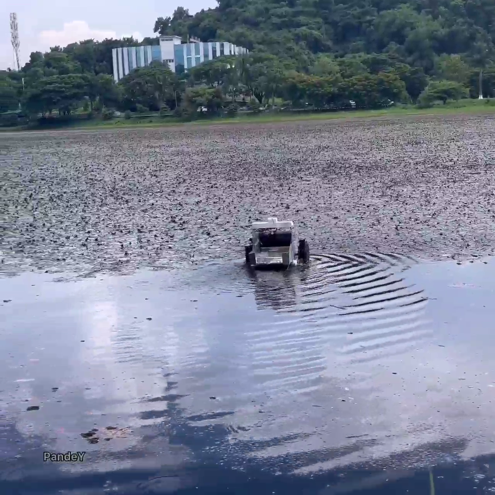

# Remotely Operated Aquatic Surface Vehicle

This project demonstrates the design and development of a low-cost, remotely operated unmanned surface vehicle (USV) for aquatic weed cutting and floating debris collection in small to medium-sized freshwater bodies.

## 🚀 Features

- **RF-Controlled Operation**: 250-meter range using FlySky 8-channel transmitter.
- **Dual Propulsion**: Two 12V DC motors with 3D-printed propeller wheels for navigation.
- **Conveyor Mechanism**: Remotely controlled belt system to collect floating debris.
- **Weed Cutting System**: Sickle-type blades driven by a servo motor for efficient weed removal.
- **Lightweight Design**: Constructed using acrylic sheets, 3D-printed parts, and hollow PVC tubes for buoyancy.

## 📂 Repository Structure

- `code/`: Arduino code for controlling propulsion, conveyor, and cutting mechanisms.
- `images/`: Photos from testing and component views.
- `results/`: Testing videos from IITG Lake and Bramhaputra river.

## 🛠 Components Used

- Arduino UNO
- Cytron 10A Motor Driver (Propulsion)
- L298N Motor Driver (Conveyor)
- FlySky 8-Channel RF Receiver/Transmitter
- 12V 6Ah Battery 
- Servo Motor (for cutter)
- 3D Printed Propellers and Structural Parts
- PVC Tubes for Buoyancy

## 📸 Sample Images

## 👨‍🔬 Developed By

**G. Lakshmi Vara Prasad**  
Junior Research Fellow (JRF)  
TIH-TIDF, Indian Institute of Technology Guwahati  
Under the guidance of **Prof. S. K. Dwivedy**

## 📄 License

This project is released under the [MIT License](LICENSE).
