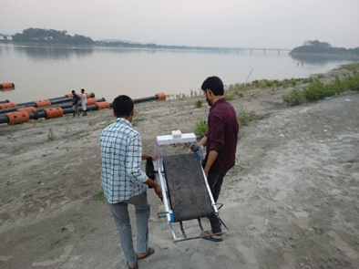
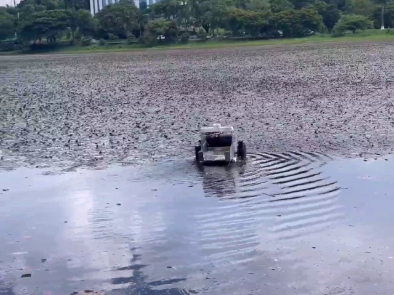

# Remotely Operated Aquatic Surface Vehicle

This project demonstrates the design and development of a low-cost, remotely operated unmanned surface vehicle (USV) for aquatic weed cutting and floating debris collection in small to medium-sized freshwater bodies.

## 🚀 Features

- **RF-Controlled Operation**: 250-meter range using FlySky 8-channel transmitter.
- **Dual Propulsion**: Two 12V DC motors with 3D-printed propeller wheels for navigation.
- **Conveyor Mechanism**: Remotely controlled belt system to collect floating debris.
- **Weed Cutting System**: Sickle-type blades driven by a servo motor for efficient weed removal.
- **Lightweight Design**: Constructed using acrylic sheets, 3D-printed parts, and hollow PVC tubes for buoyancy.

## 📂 Repository Structure

- `src/surface_vehicle`: Arduino code for controlling propulsion, conveyor, and cutting mechanisms.
- `images/`: Photos from testing and component views.
- `results/`: Testing videos from IITG Lake and Bramhaputra river.

## 🛠 Components Used

- Arduino UNO
- Cytron 10A Motor Driver (Propulsion)
- L298N Motor Driver (Conveyor)
- FlySky 8-Channel RF Receiver/Transmitter
- 12V 6Ah Battery 
- Servo Motor (for cutter)
- 3D Printed Propellers and Structural Parts
- PVC Tubes for Buoyancy

## 📸 Field Deployment

  
  

## 👨‍🔬 Developed By
<tr> <td align="center"> <strong>G. Lakshmi Vara Prasad</strong>  Junior Research Fellow (JRF)  <em>IIT Guwahati - Technology Innovation and Development Foundation</em> </td> </tr>  

## 🧭 Project Guidance
<tr> <td align="center"> <strong>Prof. S. K. Dwivedy</strong>  Project Director  <em>IIT Guwahati - Technology Innovation and Development Foundation</em> </td> </tr> 

## Acknowldgement  
I sincerely thank Mr. Alok Singh Negi (Design), Mr. Om Kumar (Manufacturing), and Mr. Sachit Narayan Pandey (Power Management) for their valuable contributions to this project.

## 📄 License

This project is released under the [MIT License](LICENSE).
